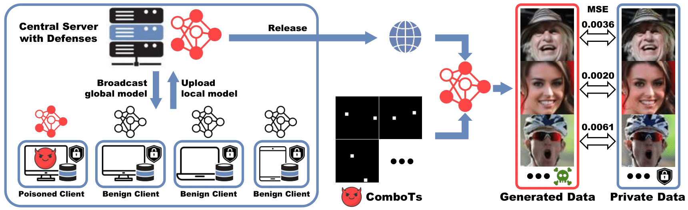

<div align="center">
    
# DataStealing: Steal Data from Diffusion Models in Federated Learning with Multiple Trojans [NeurIPS 2024]

<a href="https://yuangan.github.io/"><strong>Yuan Gan</strong></a>
·
<a href="https://scholar.google.com/citations?user=kQ-FWd8AAAAJ&hl=zh-CN&oi=ao"><strong>Jiaxu Miao</strong></a>
·
<a href="https://scholar.google.com/citations?user=RMSuNFwAAAAJ&hl=en"><strong>Yi Yang</strong></a>

<a href="https://github.com/yuangan/DataStealing"></a>

</div>
<div align="justify">

**Abstract**: Federated Learning (FL) is commonly used to collaboratively train models with privacy preservation. 
In this paper, we found out that the popular diffusion models have introduced a new vulnerability to FL, which brings serious privacy threats. 
Despite stringent data management measures, attackers can steal massive private data from local clients through multiple Trojans, which control 
generative behaviors with multiple triggers. We refer to the new task as DataStealing and demonstrate that the attacker can achieve the purpose 
based on our proposed Combinatorial Triggers (ComboTs) in a vanilla FL system. However, advanced distance-based FL defenses are still effective 
in filtering the malicious update according to the distances between each local update. Hence, we propose an Adaptive Scale Critical Parameters 
(AdaSCP) attack to circumvent the defenses and seamlessly incorporate malicious updates into the global model. Specifically, AdaSCP evaluates 
the importance of parameters with the gradients in dominant timesteps of the diffusion model. Subsequently, it adaptively seeks the optimal 
scale factor and magnifies critical parameter updates before uploading to the server. As a result, the malicious update becomes similar to 
the benign update, making it difficult for distance-based defenses to identify. Extensive experiments reveal the risk of leaking thousands 
of images in training diffusion models with FL. Moreover, these experiments demonstrate the effectiveness of AdaSCP in defeating advanced 
distance-based defenses. We hope this work will attract more attention from the FL community to the critical privacy security issues of Diffusion Models.

## Setup & Preparation

### Environment Setup
```
conda create -n datastealing python=3.9
conda install pytorch==1.12.1 torchvision==0.13.1 torchaudio==0.12.1 cudatoolkit=11.6 -c pytorch -c conda-forge
pip install absl-py==2.1.0 tensorboardX==2.6.2.2 tqdm==4.66.1 imageio==2.34.0 scipy==1.12.0 
pip install scikit-learn==1.4.1.post1 matplotlib==3.8.0 ray==2.9.1 pytorch-fid==0.3.0
```

### Data Preparation
**CIFAR10**
Download and Untar it into ```./data```:
```
cd ./data
wget https://www.cs.toronto.edu/~kriz/cifar-10-python.tar.gz
tar -xf cifar-10-python.tar.gz
```

### Model Preparation
Pretrained FL models with 5 clients: [CIFAR-10](https://disk.yandex.com/d/XhkEe5NWihCW6g)

Download and unzip the folder into ```./logs/```

## Train AdaSCP with FL Defenses

AdaSCP + Multi-Krum

```
CUDA_VISIBLE_DEVICES=0 python fedavg_ray_actor_bd_noniid/main_fed_uncond_multitarget_defense_single.py \
          --train --flagfile ./config/CIFAR10_uncond.txt \
          --batch_size_attack_per 0.5 \
          --poison_type diff_poison \
          --model_poison_scale_rate 5 \
          --defense_technique multi-krum \
          --num_targets 1000 \
          --critical_proportion 0.4 \
          --global_pruning \
          --use_adaptive \
          --adaptive_lr 0.2 \
          --data_distribution_seed 42
```

## Test Poisoned Global Model

### Poisoned Global Models
Download poisoned models from [here](https://disk.yandex.com/d/wzqExoBL-6uIpA). Unzip folders into ```./logs/``` for evaluation.

### FID
**CIFAR** Example:
```
python bash_test_fid_multi_defense.py "cuda:0" 'multi-krum_1000_0.5_diffpoi_proportion_0.4_scale_5.0_ema_0.9999_global_adaptive_0.2_single_tabel1'
```

### MSE
**CIFAR** Example:
```
python bash_test_diffusion_attack_uncond_multi_mask_seed.py "cuda:0" 1000 'multi-krum_1000_0.5_diffpoi_proportion_0.4_scale_5.0_ema_0.9999_global_adaptive_0.2_single_tabel1' 42
```

## TODO:
- [x] Environment setup
- [ ] Release the code of DataStealing.
- [ ] Release the metrics calculation of DataStealing.

